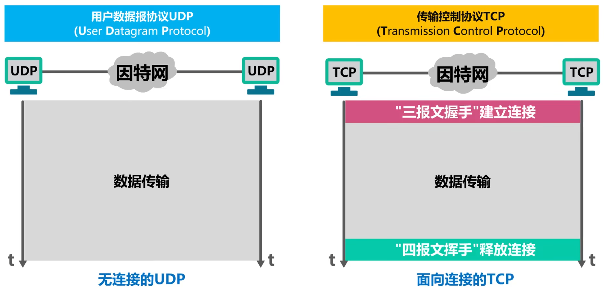
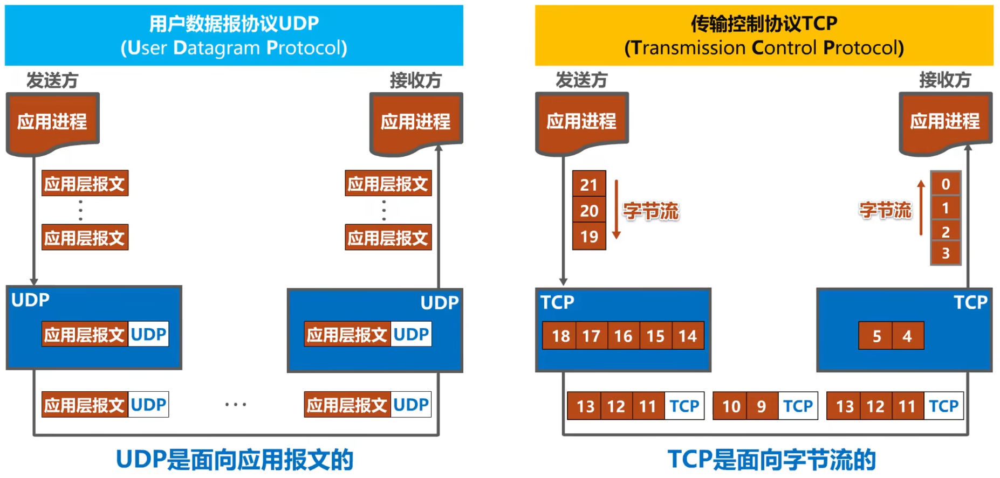
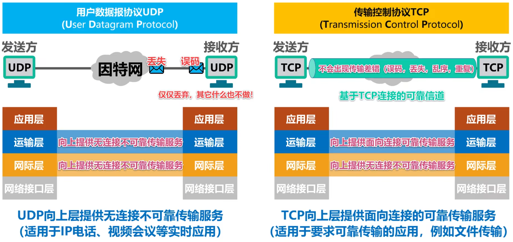

# 运输层

## 运输层概述

- 之前课程所介绍的计算机网络体系结构中的物理层、数据链路层以及网络层它们共同解决了将主机通过异构网络互联起来所面临的问题，实现了主机到主机的通信。
- 但实际上在计算机网络中进行通信的真正实体是位于通信两端主机中的进程。
- 如何为运行在不同主机上的应用进程提供直接的通信服务是运输层的任务，运输层协议又称为端到端协议。
- 运输层直接为应用进程间的逻辑通信提供服务

## 运输层端口号，复用与分用的概念

### 端口号

- 运行在计算机上的进程使用进程标识符PID来标志。
- 因特网上的计算机并不是使用统一的操作系统，不同的操作系统(windows，Linux，Mac OS)又使用不同格式的进程标识符。
- 为了使运行不同操作系统的计算机的应用进程之间能够进行网络通信
就必须使用统一的方法对
TCP/IP体系的应用进程进行标识。
- TCP/IP体系的运输层使用端口号来区分应用层的不同应用进程。
  - 端口号使用**16比特**表示，取值范围**0~65535**;
    - **熟知端口号**:0~1023，IANA把这些端口号指派给了TCP/IP体系中最重要的一些应用协议，例如:FTP使用21/20，HTTP使用80，DNS使用53。
    - **登记端口号**:1024~49151，为没有熟知端口号的应用程序使用。使用这类端口号必须在IANA按照规定的手续登记，以防止重复。例如:Microsoft RDP微软远程桌面使用的端口是3389。
    - **短暂端口号**: 49152~65535，留给客户进程选择暂时使用。当服务器进程收到客户进程的报文时，就知道了客户进程所使用的动态端口号。通信结束后，这个端口号可供其他客户进程以后使用。
  - **端口号只具有本地意义**，即端口号只是为了标识本计算机应用层中的各进程，在因特网中,不同计算机中的相同端口号是没有联系的。

### 复用与分用

- 发送方的复用和接收方的分用（复用就是打包过程，分用就是解包）

- TCP/IP体系的应用层常用协议所使用的运输层熟知端口号

## UDP和TCP的对比

- 连接方式

- 通信方式

- 传输方式

- 应用场景

- 报文格式

- 总结

| 用户数据报协议UDP(User Datagram Protocol)                    | 传输控制协议TCP(Transmission Control Protocol)    |
| ------------------------------------------------------------ | ------------------------------------------------- |
| 无连接                                                       | 面向连接                                          |
| 支持一对一，一对多，多对一和多对多互交通信                   | 每一条TCP连接只能有两个端点EP，只能是一对一通信。 |
| 对应用层交付的报文直接打包                                   | 面向字节流                                        |
| 尽最大努力交付，也就是不可靠;不使用流量控制和拥塞控制。  尽最大努力交付，也就是不可靠；不使用流量控制和拥塞控制. | 可靠传输，使用流量控制和拥塞控制。                |
| 首部开销小，仅8字节                                          | 首部最小20字节，最大60字节                        |

### TCP的流量控制

### TCP拥塞控制

### TCP超时重传时间的选择

### TCP可靠传输实现

### TCP的运输连接管理

### TCP报文段的首部格式
